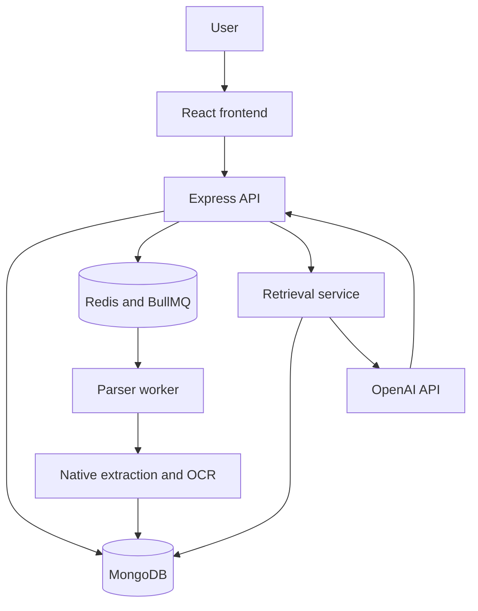
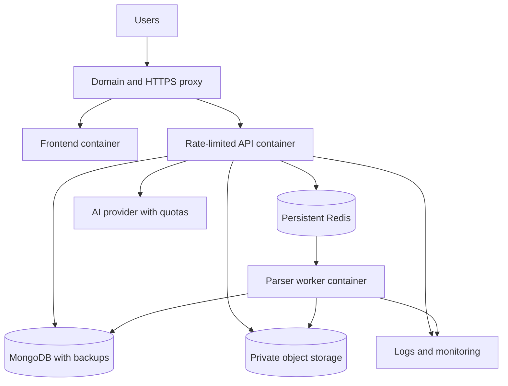

# EduVision AI Platform

EduVision is a full-stack educational AI platform that converts uploaded documents into structured, searchable learning content. It extracts native text or performs OCR, removes repetitive content, creates semantic chunks, retrieves relevant evidence, and answers questions with validated page citations.

The current project includes **Phases 1–4 and Phase 5A**: stabilization, unified parsing, token optimization, document Q&A, and asynchronous document processing.

## Key features

- Supports PDF, PNG, JPEG, DOCX, and TXT files up to 20 MB.
- Extracts native text and uses Tesseract OCR for scanned pages and images.
- Returns page-level text, extraction methods, and OCR metadata.
- Removes repeated headers, footers, page numbers, and duplicate paragraphs.
- Creates page-aware semantic chunks and counts model tokens.
- Retrieves relevant chunks using BM25-style ranking.
- Generates grounded answers with validated page citations.
- Stores document conversations and message history.
- Detects common prompt-injection attempts.
- Processes documents asynchronously with Redis, BullMQ, and a parser worker.
- Retries failed jobs with exponential backoff and processing timeouts.

## Architecture



### Frontend

The React and Vite frontend provides authentication, document upload, processing status, extracted pages, token metrics, document Q&A, citations, conversation history, dashboard, and profile screens. Axios clients provide a reusable API communication layer, while React Router separates public and protected pages.

### Backend API

The Node.js and Express backend handles authentication, uploads, document ownership, queue creation, optimization, retrieval, Q&A, citation validation, and centralized errors.

It follows a layered design:

```text
Routes → Middleware → Controllers → Services → Models
```

### Worker and queue

Parsing and OCR can take several seconds, so they run outside the HTTP request. The API stores the document as `queued`, adds a BullMQ job to Redis, and returns `202 Accepted`. The worker processes the job and changes its status to `processing`, `completed`, or `failed`.

This keeps the API responsive and allows workers to scale independently.

### Data storage

MongoDB stores:

- Users and profiles
- Documents and page-level results
- Semantic document chunks
- Q&A conversations
- Dashboard statistics and events

Every protected document, chunk, and conversation is filtered by authenticated user ownership.

## Document-processing workflow

1. The user uploads a supported file.
2. The API validates its size, extension, and MIME type.
3. The API creates a document and queues a parsing job.
4. The worker performs native extraction or OCR.
5. Results are normalized into page-level records and saved in MongoDB.
6. The frontend polls until processing finishes.
7. Optimization cleans and divides the text into semantic chunks.
8. Relevant chunks are retrieved when the user asks a question.
9. OpenAI generates an answer using the retrieved context.
10. Citations are validated and the conversation is stored.

## RAG and token optimization

EduVision uses Retrieval-Augmented Generation instead of sending an entire document to the model.

The system cleans repeated content, creates semantic chunks, preserves page references, counts tokens, and ranks chunks against the question. Only the most relevant context is sent to the AI model, reducing token usage and improving grounding.

The Q&A service verifies that cited sources and pages were actually supplied to the model. If evidence is insufficient, it returns a stable not-found response instead of inventing an answer.

## Full-stack concepts

- Component-based React user interfaces
- Protected client-side routes
- REST APIs and multipart uploads
- JWT access and refresh tokens
- Password hashing with bcrypt
- MongoDB data modeling and ownership filtering
- Asynchronous job processing
- Frontend polling and eventual consistency
- Reusable service and controller layers
- Environment-based configuration
- Centralized API error handling
- Automated backend testing

## System-design concepts

- **Separation of concerns:** frontend, API, worker, queue, database, parser, retrieval, and AI provider have distinct responsibilities.
- **Queue-based load leveling:** Redis absorbs parsing requests while workers process them according to available capacity.
- **Horizontal scaling:** API and worker instances can scale independently when they share MongoDB, Redis, and object storage.
- **Fault tolerance:** jobs use retries, exponential backoff, timeouts, and failure states.
- **Idempotency:** document IDs are used as parsing job IDs to reduce duplicate processing.
- **Eventual consistency:** uploads return before processing finishes, and the UI polls for the final state.
- **Security:** ownership checks, input validation, prompt defenses, structured output, and citation validation reduce risk.
- **Cost optimization:** cleaning and retrieval reduce the context sent to the AI model.
- **Observability:** health checks, job states, timestamps, and errors provide monitoring signals.

## Technology stack

| Layer | Technologies |
| --- | --- |
| Frontend | React, Vite, React Router, Axios, Tailwind CSS |
| Backend | Node.js, Express, MongoDB, Mongoose |
| Queue | Redis, BullMQ |
| Parsing | pdf.js, pdf2json, Mammoth, Tesseract.js |
| AI | OpenAI API with structured output |
| Optimization | js-tiktoken and BM25-style retrieval |
| Authentication | JWT and bcrypt |
| Testing | Node.js test runner |

## Project structure

```text
AiUser/                     React/Vite frontend
Backend/Backend/
├── controllers/            Request handlers
├── middleware/             Authentication and errors
├── models/                 MongoDB models
├── routes/                 API routes
├── services/               Parsing, queue, retrieval and Q&A
├── test/                   Backend tests
└── workers/                Parser worker
docker-compose.yml          Local Redis
```

## Local setup

Prerequisites: Node.js 20+, Docker Desktop, MongoDB, and an OpenAI API key.

Create `Backend/Backend/.env`:

```env
NODE_ENV=development
PORT=5000
MONGO_URI=your-mongodb-uri
FRONTEND_URL=http://localhost:3000
ACCESS_TOKEN_SECRET=your-long-secret
REFRESH_TOKEN_SECRET=your-other-long-secret
OPENAI_API_KEY=your-openai-key
SUMMARY_MODEL=your-text-model
QA_MODEL=your-structured-output-model
IMAGE_MODEL=your-image-model
VIDEO_MODEL=your-video-model
REDIS_URL=redis://127.0.0.1:6379
PARSER_CONCURRENCY=2
PARSER_TIMEOUT_MS=120000
UPLOAD_STAGING_DIR=uploads/staging
```

Create `AiUser/.env`:

```env
VITE_API_BASE_URL=http://localhost:5000
VITE_AUTH_PREFIX=/auth
VITE_DASH_PREFIX=/dash
VITE_SUMMARIZE_PREFIX=/summarize
VITE_TRACK_PREFIX=/track
```

Run the four services in separate terminals:

```powershell
# Terminal 1: repository root
docker compose up -d redis

# Terminal 2
cd Backend\Backend
npm install
npm run dev

# Terminal 3
cd Backend\Backend
npm run worker:dev

# Terminal 4
cd AiUser
npm install
npm run dev
```

Open `http://localhost:3000`.

Run verification:

```powershell
cd Backend\Backend
npm run check
npm test

cd ..\..\AiUser
npm run lint
npm run build
```

## Main API endpoints

| Method | Endpoint | Purpose |
| --- | --- | --- |
| GET | `/health/live` | API health check |
| POST | `/auth/signup` | Register |
| POST | `/auth/login` | Sign in |
| POST | `/auth/refresh` | Refresh access token |
| POST | `/documents` | Upload and queue a document |
| GET | `/documents` | List owned documents |
| GET | `/documents/:id` | Get document status and pages |
| POST | `/documents/:id/optimize` | Clean and chunk text |
| POST | `/documents/:id/retrieve` | Retrieve relevant chunks |
| POST | `/documents/:id/questions` | Ask a grounded question |
| GET | `/documents/:id/conversations` | List document conversations |
| GET | `/conversations/:id` | Load one conversation |

Protected endpoints require a bearer access token.

## Production design



A production release should add:

- Versioned frontend and backend Docker images.
- A VPS or managed container host to run the images.
- A custom domain, HTTPS, and reverse proxy.
- Private object storage instead of local upload staging.
- Persistent, authenticated Redis.
- Per-IP and per-user rate limits.
- Upload, OCR, token, and monthly AI quotas.
- Centralized logs, metrics, alerts, and error tracking.
- Automated MongoDB and object-storage backups with restore tests.
- CI/CD that tests, builds, scans, publishes, and deploys images.
- Immutable release tags with a known-good rollback version.
- Infrastructure and OpenAI budget alerts with hard spending limits.

Docker Hub stores images but does not run the application. A container host is required to make EduVision live.

## Security note

Never commit `.env`, API keys, JWT secrets, database credentials, uploads, or `node_modules`. If a credential has previously been committed or shared, revoke and rotate it before deployment.

## Roadmap

- **Completed:** Phases 1, 2, 3, 4, and 5A.
- **Next:** object storage, production containers, monitoring, backups, deployment, and CI/CD.
- **Phase 6:** study guides, flashcards, quizzes, diagram explanations, table interpretation, chapter summaries, difficulty adaptation, and cross-document search.

## License

The backend package declares the ISC license. Add a root `LICENSE` file before public distribution.
